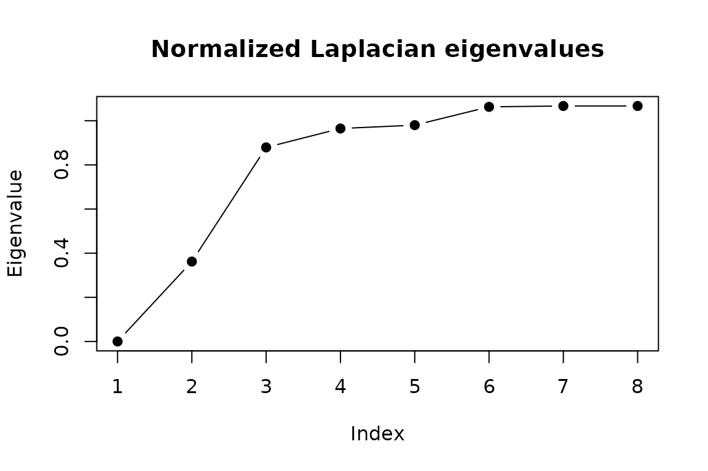
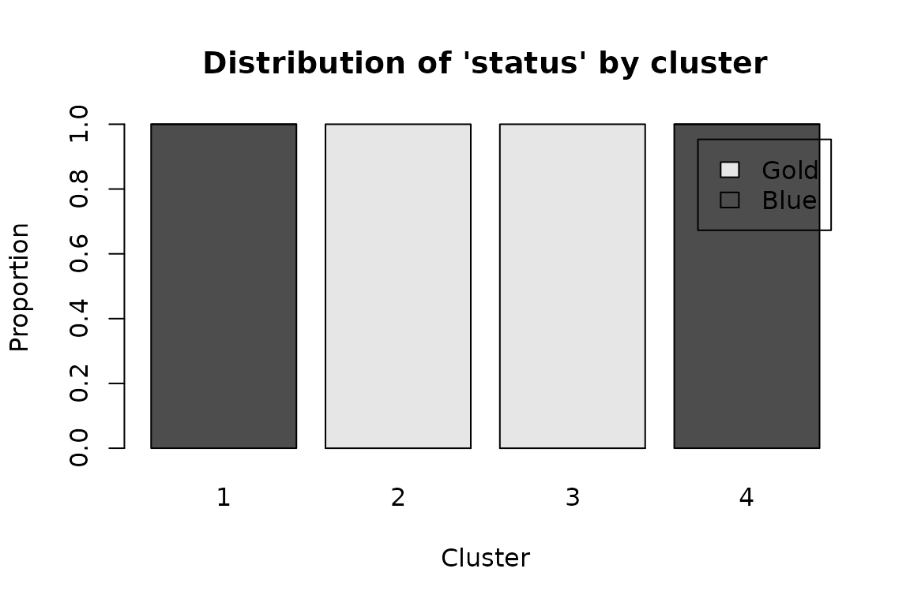

# Getting started with simOutrank

`simOutrank` clusters the traces of an event log by an *outranking*
model of similarity. Instead of collapsing every perspective into a
single distance, it scores each pair of traces on several
problem-specific criteria – activities, transitions, duration, case
attributes – and aggregates them with ELECTRE-III-style concordance and
discordance. The result is a credibility matrix `S` that a spectral or
hierarchical algorithm then partitions.

This vignette walks through the whole pipeline on the bundled
`illustrative_log`, a 25-case customer-service log from Delias et
al. (2023).

``` r

library(simOutrank)
#> 
#> Attaching package: 'simOutrank'
#> The following object is masked from 'package:base':
#> 
#>     q
head(illustrative_log)
#>   case_id activity           timestamp status satisfaction
#> 1      G1        B 2021-01-01 00:00:00   Gold         HIGH
#> 2      G1        E 2021-01-01 00:01:00   Gold         HIGH
#> 3      G2        B 2021-01-01 00:00:00   Gold         HIGH
#> 4      G2        E 2021-01-01 00:01:00   Gold         HIGH
#> 5      G3        B 2021-01-01 00:00:00   Gold         HIGH
#> 6      G3        E 2021-01-01 00:01:00   Gold         HIGH
```

## 1. Traces

[`as_traces()`](https://pdelias.github.io/simOutrank/reference/as_traces.md)
turns an event log into a `traces` object: the time-ordered,
integer-encoded activity sequence of every case, plus the case-level
attribute table.

``` r

traces <- as_traces(illustrative_log,
                    case_id = "case_id", activity = "activity",
                    timestamp = "timestamp")
traces
#> <traces>: 25 cases, 5 distinct activities
#>   trace length: min 2, median 5, max 7
#>   case attributes: status, satisfaction
summary(traces)[1:5, ]
#>   case_id n_events n_distinct
#> 1      G1        2          2
#> 2      G2        2          2
#> 3      G3        2          2
#> 4      G4        2          2
#> 5      G5        2          2
```

## 2. Criteria

Criteria are built with the `crit_*` helpers. Each carries a direction
(similarity or dissimilarity), a weight, and ELECTRE-III thresholds
(indifference, similarity, and an optional veto). Here we mirror the
four criteria of the source paper: what activities occur, in what order,
and two case attributes.

``` r

criteria <- list(
  crit_activity_profile(weight = 0.2, indifference = 0.7, similarity = 0.8,
                        veto = 0.4),
  crit_edit_distance(weight = 0.2, similarity = 2, indifference = 3, veto = 6),
  crit_nominal("status", weight = 0.3),
  crit_nominal("satisfaction", weight = 0.3)
)
criteria[[1]]
#> <criterion 'activity_profile'>: direction = similarity, weight = 0.2
#>   indifference = 0.7, similarity = 0.8, veto = 0.4
```

Thresholds may be fixed numbers or quantiles of the criterion’s own
value distribution via
[`q()`](https://pdelias.github.io/simOutrank/reference/q.md); the
[parameter-tuning
vignette](https://pdelias.github.io/simOutrank/articles/parameter-tuning.md)
explores that choice.

## 3. Similarity

[`outrank_similarity()`](https://pdelias.github.io/simOutrank/reference/outrank_similarity.md)
resolves any quantile thresholds, normalises the weights, and aggregates
the per-criterion indices into `S`.

``` r

sim <- outrank_similarity(traces, criteria)
sim
#> <outrank_sim>: 25 cases, 4 criteria
#>   S in [0.000, 1.000], symmetric = TRUE
round(sim$S[1:5, 1:5], 2)
#>    G1 G2 G3 G4 G5
#> G1  1  1  1  1  1
#> G2  1  1  1  1  1
#> G3  1  1  1  1  1
#> G4  1  1  1  1  1
#> G5  1  1  1  1  1
```

## 4. How many clusters?

[`eigengap()`](https://pdelias.github.io/simOutrank/reference/eigengap.md)
plots the smallest eigenvalues of the normalized Laplacian; a gap after
the k-th value suggests k groups.

``` r

eigengap(sim, k_max = 8)
```



## 5. Cluster

The paper targets four natural groups (tier x satisfaction). Spectral
clustering uses a seed for reproducible k-means.

``` r

clust <- cluster_traces(sim, k = 4, seed = 42)
clust
#> <outrank_clust>: 25 cases in 4 clusters (spectral)
#>   cluster sizes: 1=8, 2=6, 3=5, 4=6
split(names(clust$memberships), clust$memberships)
#> $`1`
#> [1] "B6"  "B7"  "B8"  "B9"  "B10" "B11" "B12" "B13"
#> 
#> $`2`
#> [1] "G1"  "G2"  "G3"  "G4"  "G5"  "G11"
#> 
#> $`3`
#> [1] "G6"  "G7"  "G8"  "G9"  "G10"
#> 
#> $`4`
#> [1] "B1"  "B2"  "B3"  "B4"  "B5"  "B14"
```

## 6. Use the result

Join memberships back onto the event log, inspect a cluster’s attribute
profile, and compute validity indices.

``` r

augmented <- augment_log(clust, illustrative_log)
#> Joining on case-id column 'case_id'.
head(augmented)
#>   case_id activity           timestamp status satisfaction .cluster
#> 1      G1        B 2021-01-01 00:00:00   Gold         HIGH        2
#> 2      G1        E 2021-01-01 00:01:00   Gold         HIGH        2
#> 3      G2        B 2021-01-01 00:00:00   Gold         HIGH        2
#> 4      G2        E 2021-01-01 00:01:00   Gold         HIGH        2
#> 5      G3        B 2021-01-01 00:00:00   Gold         HIGH        2
#> 6      G3        E 2021-01-01 00:01:00   Gold         HIGH        2

plot(clust, type = "profile", attribute = "status")
```



``` r


if (requireNamespace("clValid", quietly = TRUE)) {
  validate_clusters(clust)
}
#> connectivity         dunn 
#>    20.276190     0.489198
```

## Where next

- [Reproducing the illustrative
  example](https://pdelias.github.io/simOutrank/articles/reproducing-paper2.md)
  – the same pipeline framed as a published-result reproduction.
- [Robustness: constraints and
  trimming](https://pdelias.github.io/simOutrank/articles/robustness.md)
  – inject domain knowledge and remove outliers.
- [Parameter
  tuning](https://pdelias.github.io/simOutrank/articles/parameter-tuning.md)
  – weights, thresholds and k.

## Reference

Delias, P., Doumpos, M., Grigoroudis, E. and Matsatsinis, N. (2023).
Improving the non-compensatory trace-clustering decision process.
*International Transactions in Operational Research*, 30(3), 1387–1406.
<doi:10.1111/itor.13062> \`\`\`
