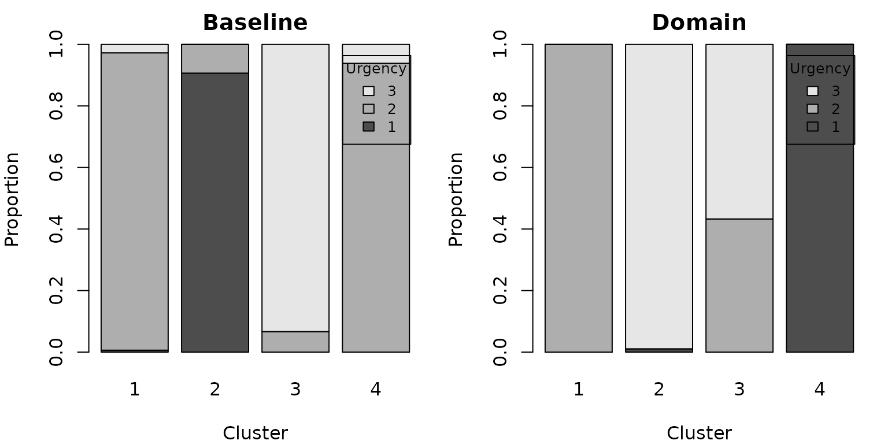

# Clustering a large event log

The credibility matrix `S` is dense and `n x n`, so `simOutrank` is
designed for logs of hundreds to a few thousand cases – the regime of
most trace clustering studies. This article measures the pipeline on a
synthetic 500-case log, then reproduces the BPIC’11 case study of Delias
et al. (2023), including its Figures 2 and 3.

## A synthetic 500-case log

``` r

templates <- list(
  a = c("register", "triage", "consult", "discharge"),
  b = c("register", "triage", "consult", "lab", "result", "discharge"),
  c = c("register", "triage", "consult", "imaging", "result", "admit",
        "discharge"),
  d = c("register", "consult", "discharge")
)
urgency_of <- c(a = "low", b = "medium", c = "high", d = "low")

make_case <- function(id) {
  kind <- sample(names(templates), 1, prob = c(0.35, 0.3, 0.2, 0.15))
  acts <- templates[[kind]]
  if (runif(1) < 0.25) acts <- c(acts, sample(acts, 1))  # a repeated step
  n <- length(acts)
  data.frame(
    case_id   = id,
    activity  = acts,
    timestamp = as.POSIXct("2011-01-01", tz = "UTC") +
                cumsum(c(0, round(rexp(n - 1, 1 / 30)))) * 60,
    urgency   = unname(urgency_of[kind]),
    stringsAsFactors = FALSE
  )
}

big_log <- do.call(rbind, lapply(sprintf("c%04d", 1:500), make_case))
nrow(big_log)
#> [1] 2606
traces <- as_traces(big_log, "case_id", "activity", "timestamp")
#> Warning: Tied timestamps within a case were ordered by original row order.
traces
#> <traces>: 500 cases, 8 distinct activities
#>   trace length: min 3, median 5, max 8
#>   case attributes: urgency
```

## Timing the pipeline

``` r

criteria <- list(
  crit_activity_profile(weight = 0.4),
  crit_edit_distance(weight = 0.3, similarity = as_quantile(0.2),
                     indifference = as_quantile(0.5)),
  crit_nominal("urgency", weight = 0.3)
)

t_sim <- system.time(sim <- outrank_similarity(traces, criteria))
t_cl  <- system.time(clust <- cluster_traces(sim, k = 4, seed = 1))
rbind(similarity = t_sim[["elapsed"]], clustering = t_cl[["elapsed"]])
#>             [,1]
#> similarity 0.101
#> clustering 0.108
```

The measures are fully vectorised (no per-pair
[`apply()`](https://rdrr.io/r/base/apply.html)), so 500 cases build `S`
in well under a second on a laptop. Memory, not time, is the practical
ceiling: `S` for `n` cases is `8 * n^2` bytes (about 2 MB at n = 500,
200 MB at n = 5000).

``` r

table(clust$memberships)
#> 
#>   1   2   3   4 
#> 193 145  91  71
eigengap(sim, k_max = 8)
```


## Trimming before clustering at scale

On real logs a few disconnected cases can distort the spectrum. Greedy
trimming is `O(n^2)` and always available; the exact integer program is
only advisable for small `n`.

``` r

trimmed <- trim_outliers(sim, prop = 0.05)      # drop the 5% least connected
length(attr(trimmed, "trimmed"))
#> [1] 25
```

## Reproducing the BPIC’11 study (Delias et al., 2023, Sec. 4.2-4.3)

The paper’s real case study clusters ~1500 cases from the Business
Process Intelligence Challenge 2011 hospital log into four groups, then
injects domain knowledge (must-link on the urgency attribute) and trims
outliers.

> **Data note.** The BPIC’11 hospital log is published on
> 4TU.ResearchData under the *4TU General Terms of Use*, which do not
> clearly permit redistribution of derivatives. We therefore **do not
> ship** the preprocessed log or the precomputed similarity matrix with
> the package. To run the pipeline below, obtain the log from its [4TU
> record](https://doi.org/10.4121/uuid:d9769f3d-0ab0-4fb8-803b-0d1120ffcf54)
> and reproduce `similarity_ord.rds` as described in the paper. The two
> *aggregate figure tables* used just below carry no case-level data and
> are bundled, so the figures reproduce here directly.

With the similarity matrix in hand, the clustering and robustness steps
are the usual API (shown but not run here):

``` r

S <- readRDS("similarity_ord.rds")               # your reproduced matrix
ids <- as.character(seq_len(nrow(S)))
dimnames(S) <- list(ids, ids)
sim <- structure(list(S = S, C = S, D = 1 - S, case_ids = ids,
                      criteria = list(), case_attributes = NULL,
                      partials = NULL), class = "outrank_sim")

clust <- cluster_traces(sim, k = 4, seed = 1000, nstart = 100)
table(clust$memberships)                         # 250 / 292 / 465 / 493

trimmed <- trim_outliers(sim, prop = 0.05)       # drop the 75 least connected
```

### Figure 2 – must-link on urgency

The baseline clustering scatters each urgency category across clusters;
a must-link constraint on urgency concentrates them.

``` r

mu <- read.csv(system.file("extdata", "MustLink_Urgency.csv",
                           package = "simOutrank"))
mu$Urgency <- factor(mu$Urgency.y)
op <- par(mfrow = c(1, 2), mar = c(4, 4, 2, 1))
for (m in c("Baseline", "Domain")) {
  tab <- xtabs(freq ~ Urgency + kmL.cluster, mu[mu$Method == m, ])
  barplot(tab, main = m, xlab = "Cluster", ylab = "Proportion",
          col = gray.colors(nrow(tab)), legend.text = rownames(tab),
          args.legend = list(title = "Urgency", cex = 0.8))
}
```



``` r

par(op)
```

### Figure 3 – trimming vs. model complexity

Trimming a few outliers reduces the complexity of the discovered process
models (cyclomatic number CN and its coefficients CNC / CNCk).

``` r

tp <- read.csv(system.file("extdata", "Outliers_trimmingPLG.csv",
                           package = "simOutrank"))
avg <- tp[tp$Value == "Average", ]
avg <- avg[order(avg$Percentage), ]
op <- par(mfrow = c(1, 3), mar = c(4, 4, 2, 1))
for (metric in c("CN", "CNC", "CNCK")) {
  plot(avg$Percentage, avg[[metric]], type = "b", pch = 19,
       xlab = "Trimming %", ylab = metric, main = metric)
}
```


``` r

par(op)
```

For logs beyond a few thousand cases, cluster a representative sample or
pre-aggregate identical traces before building `S`. \`\`\`
